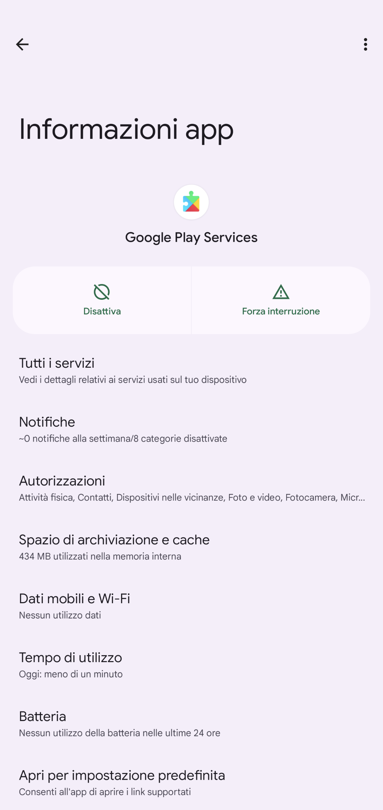
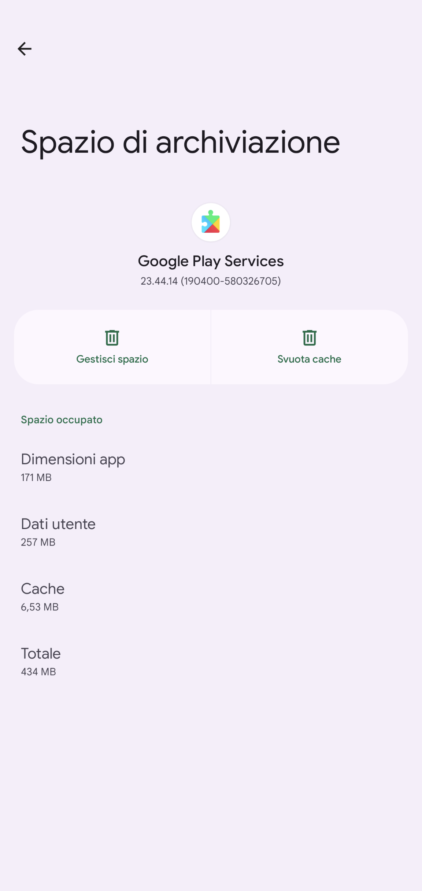
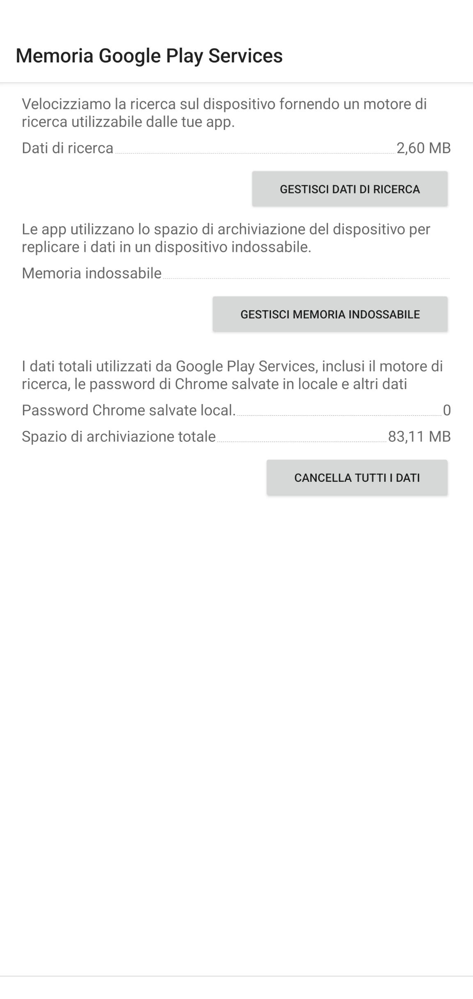
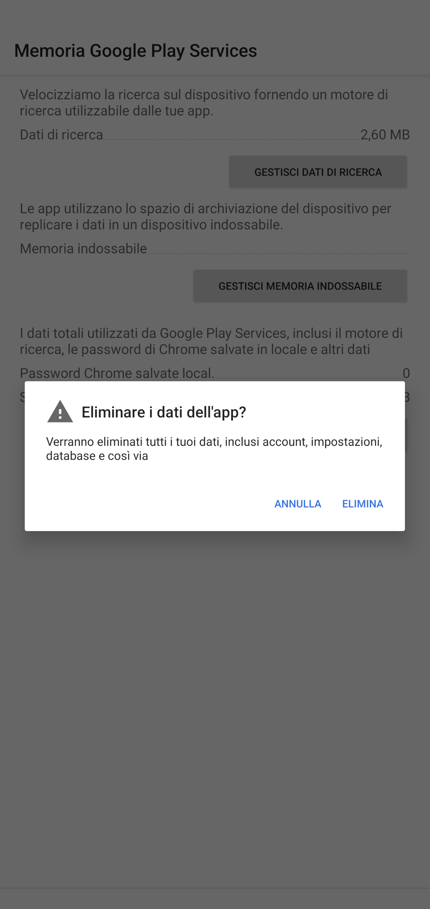

<!-- Google tag (gtag.js) -->

# La mia app Android Auto non funziona

## La tua guida definitiva per il debug automatico di Android  [FR](./repare.md)    [EN](./repair.md)        [DE](./reparieren.md)         [ES](./reparar.md)  

Questo blog si concentra principalmente sul processo di debug, per il processo di accoppiamento utilizza la [guida automatica di Google Android](https://support.google.com/androidauto/answer/6348029?hl=en).

Guido tutti i giorni e, per la maggior parte del tempo, non ho bisogno di Android Auto. Ma di tanto in tanto ho bisogno di Android Auto per la navigazione.
Sfortunatamente, Android Auto non è sempre stabile. Durante l'anno scorso ho trascorso alcuni mesi a eseguire il debug e testare il motivo per cui non funziona.
Dopo aver acquistato due telefoni Pixel e aver provato molte volte con diverse combinazioni di app, ho scoperto che il problema è legato al servizio Google Play.
Poiché Google Play Service è un servizio che non puoi disattivare, non è possibile sviluppare un'altra app per far funzionare Android Auto.

Ma ho finalmente trovato un'opzione per far funzionare Android Auto, cosa resa possibile dall'app Auto Companion [Auto Companion](https://play.google.com/store/apps/details?id=com.ingenika.autocompanion ).

Dopo aver eseguito l'app Auto Companion, scollegare il telefono dall'auto e ricollegarlo all'auto, normalmente, dovrebbe risolvere il problema.

Se il passaggio precedente non funziona, puoi provare a riavviare l'unità principale e riprovare.

A volte, con l'aggiornamento della versione di Android Auto, questo approccio non funziona, puoi provare a dimenticare il dispositivo Bluetooth sulla tua auto e ad associare nuovamente il telefono.

Se questo passaggio non funziona, disinstalla l'aggiornamento dell'app Android Auto e ripeti nuovamente le procedure precedenti.
   1. Cancella la ***cache*** e lo spazio di archiviazione*** di Android Auto
   2. Cancella ***cache*** e ***spazio di archiviazione*** dell'app di ricerca di Google
   3. Cancella la ***cache*** e lo ***spazio di archiviazione*** del servizio ggoogle play , , , 
   4. Potrebbe essere necessario anche svuotare la ***cache*** e lo ***storage*** di Google Maps

dopo questi passaggi, ricomincia il processo di abbinamento con l'unità principale dell'auto

E se sei a tuo agio nel disabilitare l'aggiornamento del servizio Google Play. Esiste un'opzione per far funzionare Android Auto, senza eseguire molto spesso l'app di accompagnamento automatico:

Trova una versione del servizio Google Play che funzioni, disabilita Google Play Store. Pertanto, poiché il servizio Google Play è parcheggiato a quella versione, non verrà aggiornato e non causerà problemi con Android Auto.

Ecco un video sull'utilizzo dell'app Auto Companion Pro, che è una versione migliorata dell'app Auto Companion su [youtube](https://www.youtube.com/@kluane)

Se questi passaggi ti sono utili, considera l'acquisto dell'app [Auto Companion Pro](https://play.google.com/store/apps/details?id=com.ingenika.autocompanionpro) che può migliorare notevolmente il debug automatico di Android processi. Normalmente è necessario fare molto clic avanti e indietro per trovare queste impostazioni e apportare modifiche, con Auto Companion Pro, è un punto fermo per il debug automatico di Android. Soprattutto quando si è di fretta o in caso di emergenza, il tempo può salvare la vita.
​