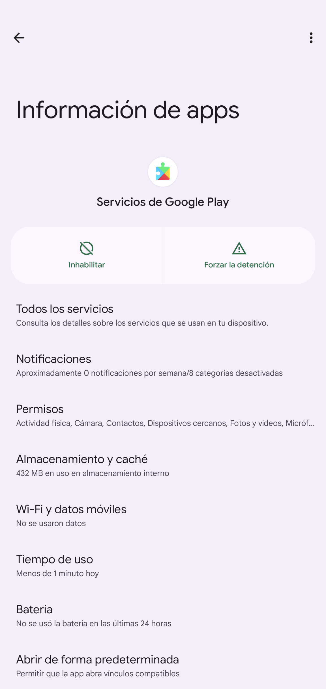
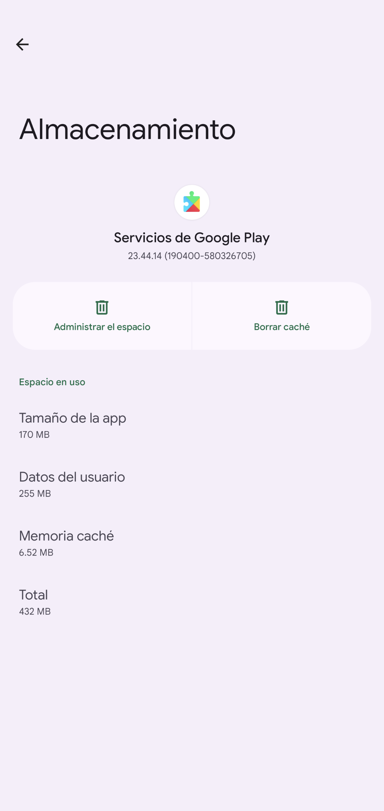
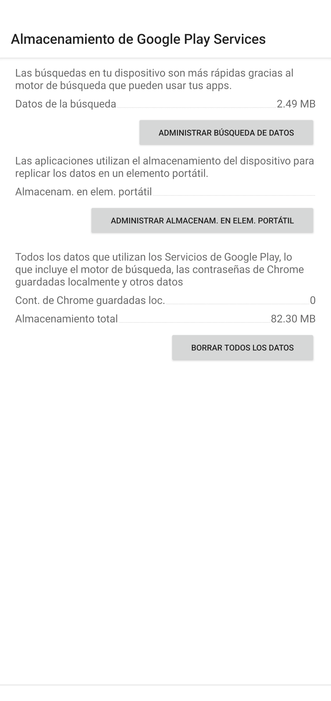
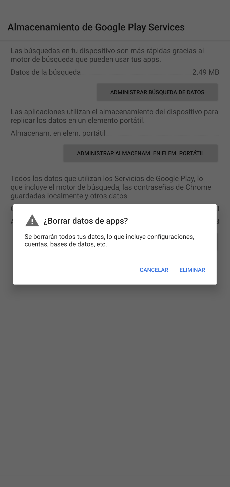

<!-- Google tag (gtag.js) -->

# Mi aplicación Android Auto no funciona

## Tu guía definitiva para la depuración automática de Android [FR](./repare.md)    [EN](./repair.md)        [DE](./reparieren.md)        [IT](./reparieren.md)

Este blog se centra principalmente en el proceso de depuración. Para el proceso de emparejamiento, utilice la [guía automática de Google Android] (https://support.google.com/androidauto/answer/6348029?hl=en).

Conduzco todos los días y la mayor parte del tiempo no necesito Android Auto. Pero de vez en cuando necesito Android Auto para navegar.
Desafortunadamente, Android Auto no siempre es estable. Durante el año pasado, pasé algunos meses depurando y probando por qué no funciona.
Después de comprar dos teléfonos Pixel y probar muchas veces con diferentes combinaciones de aplicaciones, descubrí que el problema está relacionado con el servicio Google Play.
Como el servicio Google Play es un servicio que no se puede desactivar, no es posible desarrollar otra aplicación para que Android funcione automáticamente.

Pero finalmente encontré una opción para hacer que Android funcione automáticamente, lo cual es posible gracias a la aplicación Auto Companion [Auto Companion](https://play.google.com/store/apps/details?id=com.ingenika.autocompanion ).

Después de ejecutar la aplicación Auto Companion, desconecte su teléfono del automóvil y vuelva a conectarlo al automóvil; normalmente, esto debería resolver el problema.

Si el paso anterior no funciona, puede intentar reiniciar su unidad principal e intentarlo nuevamente.

A veces, con la actualización de la versión grande de Android Auto, este enfoque no funciona; puede intentar olvidar el dispositivo Bluetooth de su automóvil y vincular el teléfono nuevamente.

Si este paso no funciona, desinstale la actualización de la aplicación automática de Android y repita los procedimientos anteriores nuevamente.
   1. Borre el ***caché*** y el ***almacenamiento*** automáticos de Android
   2. Borre el ***caché*** y el ***almacenamiento*** de la aplicación de búsqueda de Google
   3. Borrar el ***caché*** y el ***almacenamiento*** del servicio ggoogle play  , , , 
   4. Es posible que también necesites borrar el ***caché*** y el ***almacenamiento*** de Google Maps.

Después de estos pasos, comience de nuevo el proceso de emparejamiento con la unidad principal de su automóvil.

Y si se siente cómodo desactivando la actualización del servicio Google Play. Existe una opción para hacer que Android funcione automáticamente, sin necesidad de ejecutar la aplicación complementaria automática con mucha frecuencia:

Busque una versión del servicio Google Play que esté funcionando y desactive Google Play Store. Entonces, debido a que el servicio Google Play está estacionado en esa versión, no se actualizará y no causará problemas con Android Auto.

Aquí hay un video sobre el uso de la aplicación Auto Companion Pro, que es una versión mejorada de la aplicación Auto Companion en [youtube](https://www.youtube.com/@kluane)

Si estos pasos son útiles para usted, considere comprar la aplicación [Auto Companion Pro](https://play.google.com/store/apps/details?id=com.ingenika.autocompanionpro) que puede mejorar mucho la depuración automática de su Android. proceso. Normalmente, es necesario hacer clic mucho hacia adelante y hacia atrás para encontrar estas configuraciones y realizar cambios; con Auto Companion Pro, es una parada única para la depuración automática de Android. Especialmente cuando tiene prisa o se encuentra en una emergencia, el tiempo puede salvarle la vida.