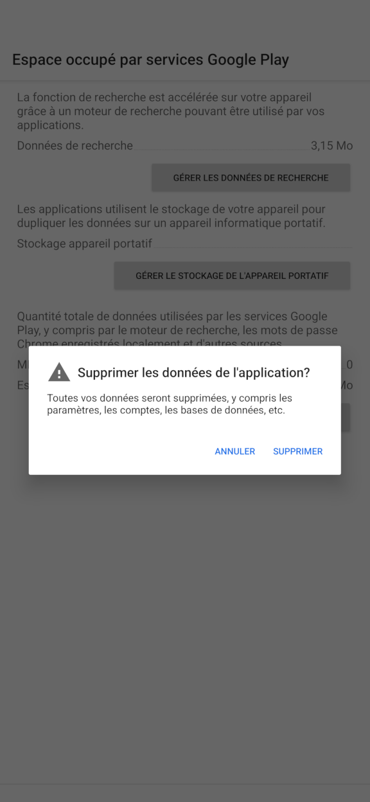

<!-- Google tag (gtag.js) -->

# Mon Android Auto app ne fonctionne plus
## Votre guide ultime pour le débogage Android Auto					[FR](./repare.md)             [EN](./repair.md)

Ce blog se concentre principalement sur le processus de débogage. Pour le processus de couplage, veuillez utiliser le [guide automatique Google Android](https://support.google.com/androidauto/answer/6348029?hl=en).

Je conduis tous les jours et la plupart du temps, je n'ai pas besoin d'Android Auto. Mais de temps en temps, j’ai besoin d’Android Auto pour la navigation.
Malheureusement, Android Auto n’est pas toujours stable. Au cours de l'année dernière, j'ai passé quelques mois à déboguer et tester pourquoi cela ne fonctionne pas.
Après avoir acheté deux téléphones Pixel et essayé plusieurs fois avec différentes combinaisons d'applications, j'ai découvert que le problème était lié au service Google Play.
Comme le service Google Play est un service que vous ne pouvez pas désactiver, il n'est pas possible de développer une autre application pour faire fonctionner Android Auto.

Mais j'ai enfin trouvé une option pour faire fonctionner Android automatiquement, ce qui est rendu possible par l'application Auto Companion [Auto Companion](https://play.google.com/store/apps/details?id=com.ingenika.autocompanion ).

Après avoir exécuté l'application Auto Companion, déconnectez votre téléphone de la voiture, reconnectez-le à la voiture, cela devrait normalement résoudre le problème.

Si l'étape ci-dessus ne fonctionne pas, vous pouvez essayer de redémarrer votre unité principale et réessayer.

Parfois, avec une mise à niveau importante d'Android Auto, cette approche ne fonctionne pas, vous pouvez essayer d'oublier le périphérique Bluetooth de votre voiture et de coupler à nouveau le téléphone.

Si cette étape ne fonctionne pas, désinstallez la mise à jour de l'application Android Auto, répétez à nouveau les procédures précédentes.
   1. Effacer le ***cache*** et le ***stockage automatique Android***
   2. Effacez le ***cache*** et le ***stockage de l'application de recherche Google***
   3. Effacez le ***cache*** et le ***stockage*** de Services Google Play. , , , 
   4. Vous devrez peut-être également effacer le ***cache*** et le ***stockage de Google Maps***

après ces étapes, recommencez le processus d'appairage avec l'unité principale de votre voiture

Et si vous êtes à l'aise pour désactiver la mise à jour du service Google Play. Il existe une option pour faire fonctionner Android Auto, sans avoir à exécuter très souvent l'application compagnon automatique :

Recherchez une version du service Google Play qui fonctionne, désactivez Google Play Store. Ainsi, comme le service Google Play est stationné sur cette version, il ne sera pas mis à niveau et ne posera pas de problèmes avec Android Auto.

Voici une vidéo d'utilisation de l'application Auto Companion Pro, qui est une version améliorée de l'application Auto Companion sur [youtube](https://www.youtube.com/@kluane)

Si ces étapes vous sont utiles, envisagez d'acheter l'application [Auto Companion Pro](https://play.google.com/store/apps/details?id=com.ingenika.autocompanionpro) qui peut grandement améliorer votre débogage automatique Android. processus. Normalement, vous devez cliquer beaucoup pour trouver ces paramètres et apporter des modifications. Avec Auto Companion Pro, c'est un guichet unique pour le débogage automatique Android. Surtout lorsque vous êtes pressé ou en cas d’urgence, le temps peut sauver des vies.