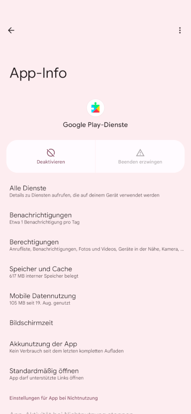
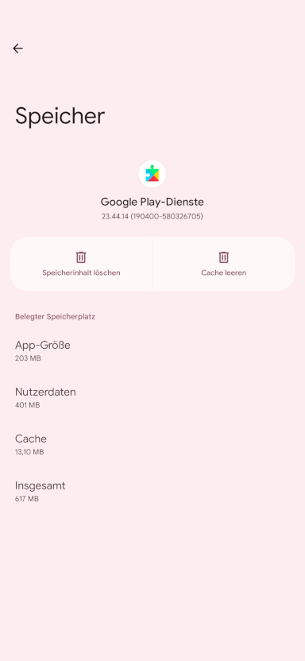
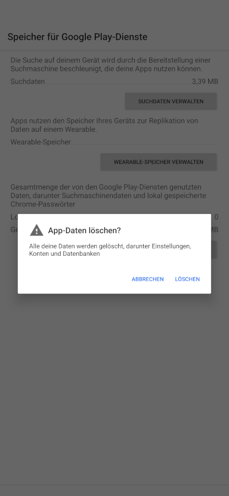

<!-- Google tag (gtag.js) -->

# Meine Android Auto-App funktioniert nicht mehr
## Ihr ultimativer Leitfaden für das Android Auto-Debugging      						[FR](./repare.md)				[EN](./repair.md)

Dieser Blog konzentriert sich hauptsächlich auf den Debugging-Prozess. Für den Pairing-Prozess verwenden Sie bitte [Google Android Auto Guide](https://support.google.com/androidauto/answer/6348029?hl=en).

Ich fahre jeden Tag und meistens brauche ich kein Android Auto. Aber ab und zu benötige ich Android Auto für die Navigation.
Leider ist Android Auto nicht immer stabil. Im letzten Jahr habe ich ein paar Monate damit verbracht, Fehler zu beheben und zu testen, warum es nicht funktioniert.
Nachdem ich zwei Pixel-Telefone gekauft und viele Male mit verschiedenen App-Kombinationen probiert habe, habe ich festgestellt, dass das Problem mit dem Google Play-Dienst zusammenhängt.
Da der Google Play-Dienst ein Dienst ist, den Sie nicht deaktivieren können, ist es nicht möglich, eine andere App zu entwickeln, damit Android Auto funktioniert.

Aber ich habe endlich eine Option gefunden, um Android Auto zum Laufen zu bringen, was durch die Auto Companion App [Auto Companion](https://play.google.com/store/apps/details?id=com.ingenika.autocompanion) ermöglicht wird ).

Nachdem Sie die Auto Companion App ausgeführt haben, trennen Sie Ihr Telefon vom Auto und schließen Sie es wieder an das Auto an. Normalerweise sollte das Problem behoben sein.

Wenn der obige Schritt nicht funktioniert, können Sie versuchen, Ihr Hauptgerät neu zu starten und es erneut zu versuchen.

Manchmal funktioniert dieser Ansatz bei einem großen Versions-Upgrade von Android Auto nicht. Sie können versuchen, das Bluetooth-Gerät in Ihrem Auto zu vergessen und das Telefon erneut zu koppeln.

Wenn dieser Schritt nicht funktioniert, deinstallieren Sie das Update der Android Auto-App und wiederholen Sie die vorherigen Schritte erneut.
   1. Android Auto ***Cache*** und ***Speicher*** löschen
   2. Leeren Sie den ***Cache*** und den ***Speicher*** der Google-Such-App. , , , ,
   3. Löschen Sie den ***Cache*** und ***Speicher*** des Google Play-Dienstes
   
   4. Möglicherweise müssen Sie auch den ***Cache*** und den ***Speicher*** von Google Maps leeren.

Beginnen Sie nach diesem Schritt erneut mit dem Pairing-Vorgang mit Ihrer Auto-Headunit

Und wenn Sie sich wohl fühlen, können Sie die Aktualisierung des Google Play-Dienstes deaktivieren. Es gibt eine Option, um Android Auto zum Laufen zu bringen, ohne die Auto Companion-App sehr oft ausführen zu müssen:

Suchen Sie nach einer funktionierenden Version des Google Play-Dienstes und deaktivieren Sie den Google Play Store. Da der Google Play-Dienst in dieser Version geparkt ist, wird er nicht aktualisiert und verursacht keine Probleme mit Android Auto.

Hier ist ein Video zur Verwendung der Auto Companion Pro App, einer verbesserten Version der Auto Companion App auf [youtube](https://www.youtube.com/@kluane)

Wenn diese Schritte für Sie hilfreich sind, erwägen Sie bitte den Kauf der App [Auto Companion Pro](https://play.google.com/store/apps/details?id=com.ingenika.autocompanionpro), die Ihr Android-Auto-Debugging erheblich verbessern kann Verfahren. Normalerweise müssen Sie viel hin- und herklicken, um diese Einstellungen zu finden und Änderungen vorzunehmen. Mit Auto Companion Pro erhalten Sie alles aus einer Hand für das automatische Debuggen von Android. Besonders wenn Sie in Eile sind oder sich in einem Notfall befinden, kann Zeit Leben retten.
